<h1 align="center">🧮 BMI Calculator App (Android)</h1>

A modern <b>BMI (Body Mass Index) Calculator</b> Android application built using
<b>Kotlin</b> and <b>Jetpack Compose</b>.

<h2>✨ Features</h2>

<ul>
  <li>📏 <b>Metric & Imperial Units</b>
    <ul>
      <li>Metric: meters (m), kilograms (kg)</li>
      <li>Imperial: feet (ft), pounds (lb)</li>
      <li>Automatic unit conversion when toggling</li>
    </ul>
  </li>

  <li>🚻 <b>Gender Selection</b>
    <ul>
      <li>Male / Female toggle</li>
      <li>Used to label healthy weight range</li>
    </ul>
  </li>

  <li>🎯 <b>Accurate BMI Calculation</b>
    <ul>
      <li>Validates height and weight inputs</li>
      <li>Handles metric ↔ imperial conversion internally</li>
    </ul>
  </li>

  <li>🎨 <b>Animated BMI Indicator</b>
    <ul>
      <li>Circular progress ring</li>
      <li>Color-coded BMI categories:
        <ul>
          <li>🟡 Underweight</li>
          <li>🟢 Healthy</li>
          <li>🟠 Overweight</li>
          <li>🔴 Obese</li>
        </ul>
      </li>
    </ul>
  </li>

  <li>📊 <b>Healthy Weight Range</b>
    <ul>
      <li>Calculated using BMI limits (18.5 – 24.9)</li>
      <li>Unit-aware (kg / lb)</li>
    </ul>
  </li>

  <li>💡 <b>Input Validation</b>
    <ul>
      <li>Error handling for invalid values</li>
      <li>Toast messages for user feedback</li>
    </ul>
  </li>

  <li>🌙 <b>Modern Dark UI</b>
    <ul>
      <li>Built entirely with Jetpack Compose</li>
      <li>Smooth animations & custom theming</li>
    </ul>
  </li>
</ul>

<h2>📱 Screenshots</h2>

Screens included in this repository demonstrate:

<ul>
  <li>
    <b>Male – Healthy BMI</b> 
    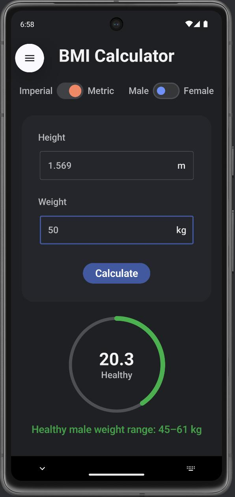
  </li>

  <li>
    <b>Female – Healthy BMI</b> 
    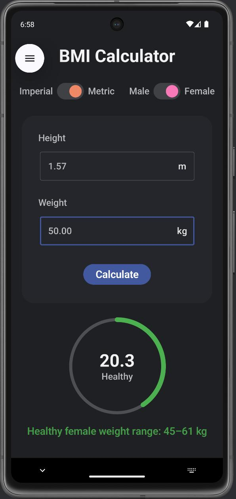
  </li>

  <li>
    <b>Female – Over weight</b> 
    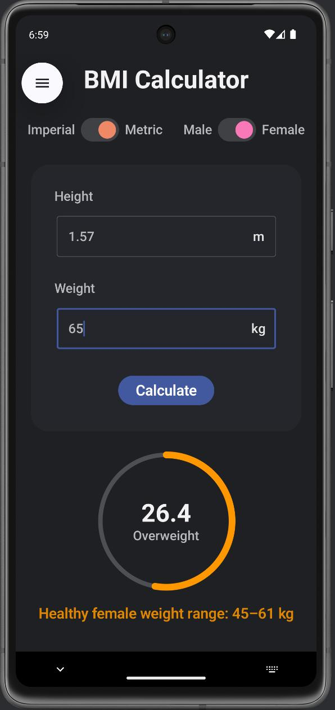
  </li>

  <li>
    <b>Female – Obese</b> 
    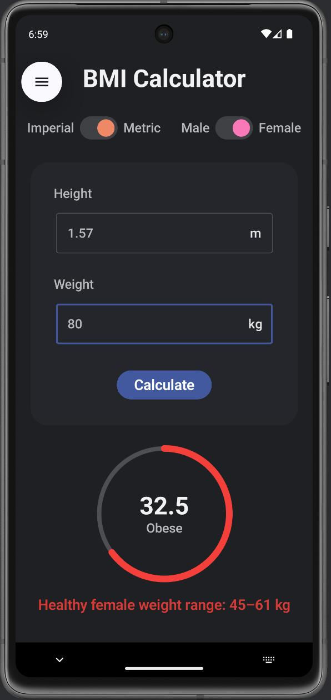
  </li>

  <li>
    <b>Imperial Mode – Male</b> 
    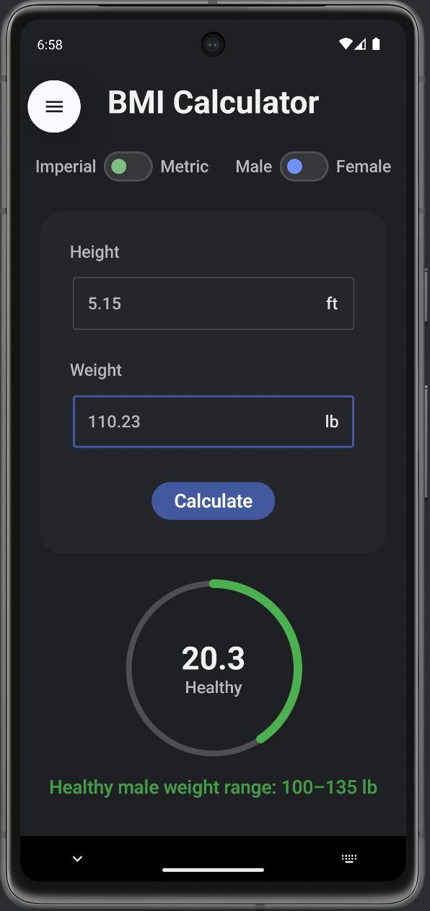
  </li>

  <li>
    <b>Input System</b> 
    
  </li>
</ul>

<li>
    <b>Mandatory Input</b> 
    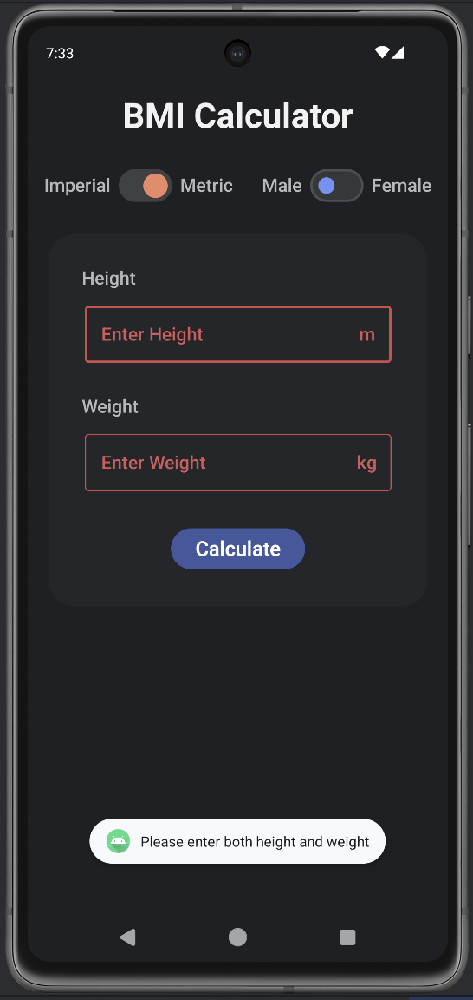
    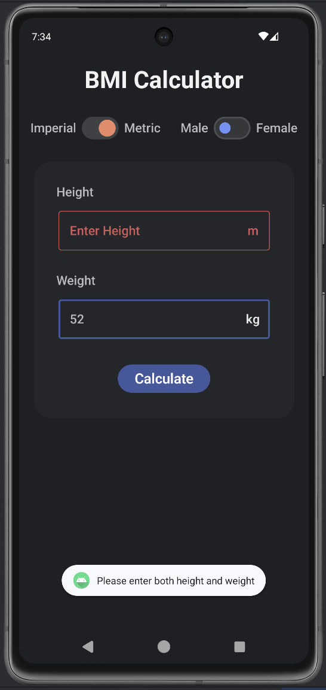
    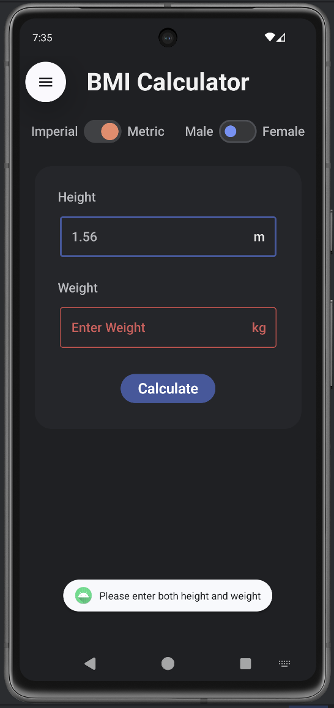
    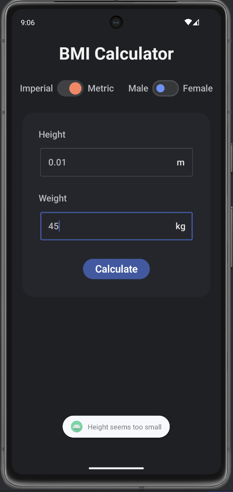
    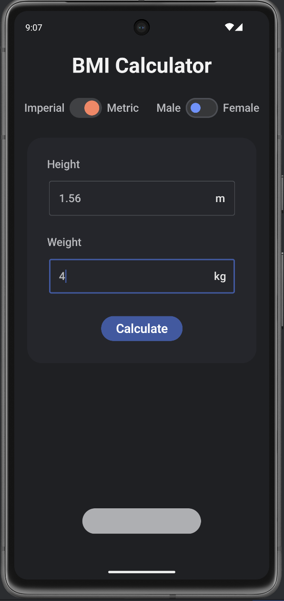
  </li>
</ul>

<li>
    <b>Imperial to Metric on Single Input</b> 
    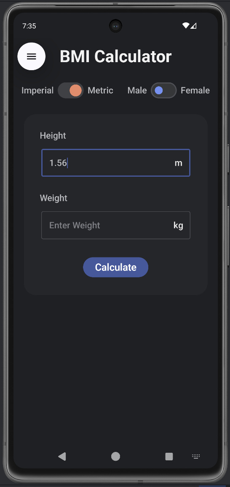
    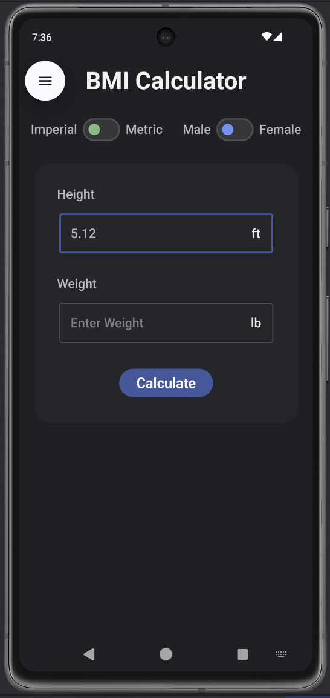
    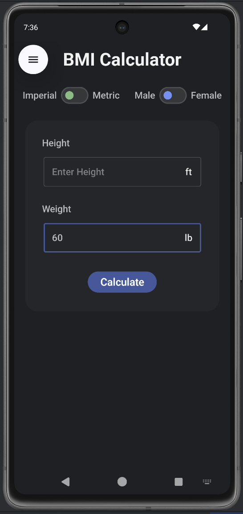
    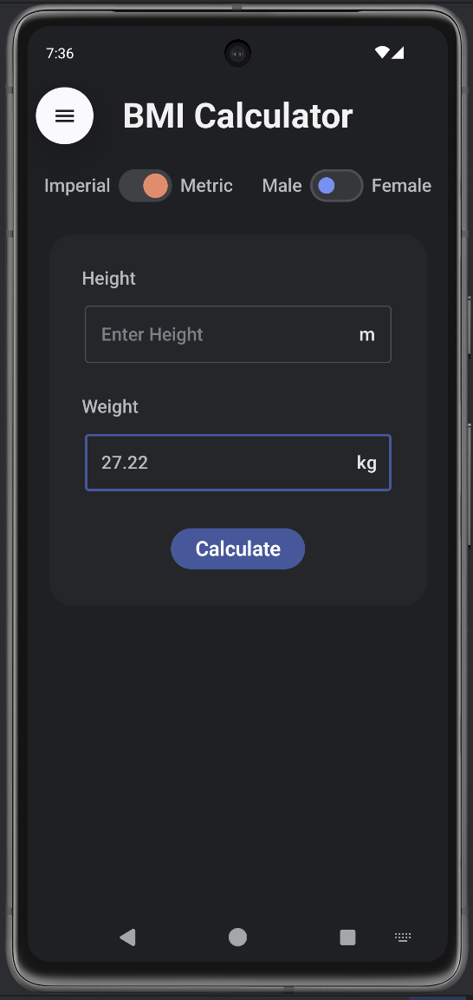
  </li>
</ul>

<h2>🛠️ Tech Stack</h2>

<ul>
  <li><b>Language:</b> Kotlin</li>
  <li><b>UI Toolkit:</b> Jetpack Compose</li>
  <li><b>Architecture:</b> State-based Compose UI</li>
  <li><b>Build System:</b> Gradle (Kotlin DSL)</li>
  <li><b>IDE:</b> Android Studio</li>
</ul>

<h2>📂 Project Structure</h2>

<pre>
app/
 └── src/
     └── main/
         ├── java/
         │   └── kush/android/bmi_calculator/
         │       ├── MainScreen.kt
         │       ├── BMI_Logic.kt
         │       └── ui/theme/
         └── res/
</pre>

<h2>🧠 BMI Logic</h2>

<b>Formula Used:</b>

<pre>
BMI = weight (kg) / (height (m))²
</pre>

<ul>
  <li>Imperial values are converted internally</li>
  <li>Feet → meters</li>
  <li>Pounds → kilograms</li>
</ul>

<h3>BMI Categories</h3>

<table>
  <tr>
    <th>BMI Range</th>
    <th>Category</th>
  </tr>
  <tr>
    <td>&lt; 18.5</td>
    <td>Underweight</td>
  </tr>
  <tr>
    <td>18.5 – 24.9</td>
    <td>Healthy</td>
  </tr>
  <tr>
    <td>25 – 29.9</td>
    <td>Overweight</td>
  </tr>
  <tr>
    <td>≥ 30</td>
    <td>Obese</td>
  </tr>
</table>

<h2>📌 Key Highlights</h2>

<ul>
  <li>Unit conversion handled during toggle switch</li>
  <li>Smooth animations using <code>AnimatedVisibility</code></li>
  <li>Custom Canvas drawing for BMI ring</li>
  <li>Clean separation of UI and logic</li>
</ul>

<h2>🔮 Future Improvements</h2>

<ul>
  <li>Save BMI history</li>
  <li>Age-based health insights</li>
  <li>Graphical BMI trends</li>
  <li>Improved accessibility</li>
  <li>Multi-language support</li>
</ul>

